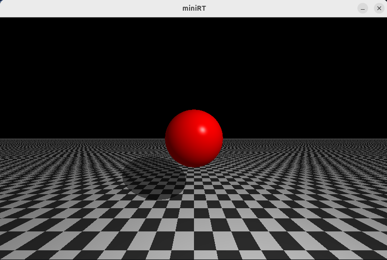
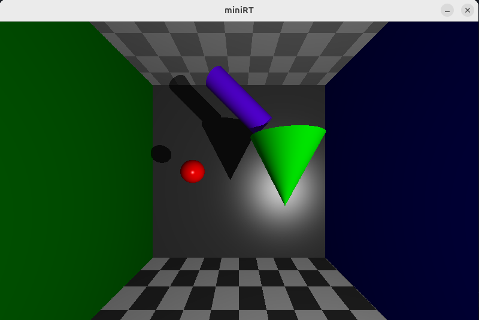
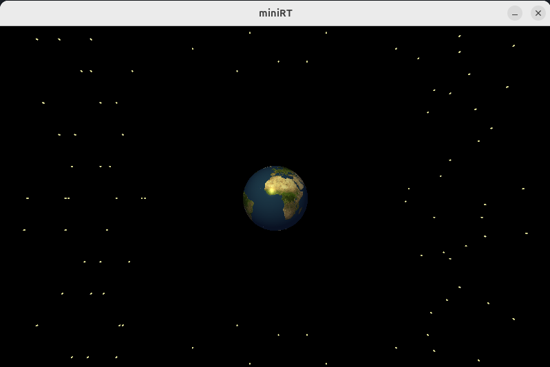

# MiniRT

A real-time ray tracer written in C, using the MiniLibX graphics library.

## 📖 Overview

MiniRT is a minimal ray tracing project developed in C as part of the 42 programming curriculum. It renders 3D scenes from .rt files using ray tracing algorithms and real-time graphics output via the MiniLibX library.

## ✨ Features

* Support for basic geometric primitives (Sphere, Plane, Cylinder, Cone)

* The Phong reflection model.

* Camera with viewport and field of view

* Shadows and basic shading

* Multi-spot lights

* Bump-map textures (.xpm)

* Window display using MiniLibX

* Checkerboard pattern color disruption

* Scene parsing from .rt files

## ⚙️ Requirements

- Linux distro

- GCC or Clang

- MiniLibX (included as a submodule)

- Make

## 🛠️ Installation

Clone the repository:

```bash
git clone https://github.com/Jzackiewicz/42-miniRT.git
cd minirt
```
If you're using the included MLX submodule:
```bash
git submodule init
git submodule update
```

Build the project:
```bash
make
```

Run MiniRT with a scene file:
```bash
./miniRT scenes/space.rt
```
## 🚀 Usage

Scene files (.rt) define the 3D world to be rendered. A sample scene file includes:
```bash
A 0.2 255,255,255
C -50,0,20 0,0,1 70
L -40,0,30 0.7 255,255,255
sp 0,0,20 20 255,0,0
pl 0,0,0 0,1,0 0,255,0
cy 50,0,20 0,0,1 14 20 0,0,255
```

* A: Ambient lighting

    A <ratio> <R,G,B>


* C: Camera
    
    C <x,y,z> <normalized_vec<x,y,z>> <FOV>


* L: Light
   
    L <x,y,z> <brightness> <R,G,B>


* sp: Sphere

    sp <x,y,z> <diameter> <R,G,B> <checkerboard> [texture_path]

* pl: Plane

    pl <x,y,z> <norm_x,y,z> <R,G,B> <checkerboard> [texture_path]

* cy: Cylinder

    cy <x,y,z> <norm_x,y,z> <diameter> <height> <R,G,B> <checkerboard>     [texture_path]

* co: Cone

    co <x,y,z> <norm_x,y,z> <diameter> <height> <R,G,B> <checkerboard>     [texture_path]


## 🎮 Examples





## Notes 📌
👀 If you notice any bugs, feel free to fork the repository & submit a pull request!

📢 If you're a 42 student, use this as a guide at most. Don't cheat, learn! <3

📅 Created from March to May 2025 as part of 42's Common Core at 42 Warsaw

## 📄 License
This project is licensed under the MIT License. See LICENSE for details.

## 👨‍💻 Authors

https://github.com/Jzackiewicz

https://github.com/bobbyskywalker